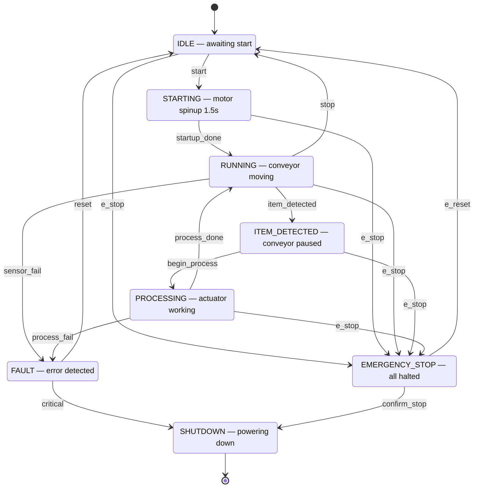

# Process Line Controller — Raspberry Pi FSM

A Python asyncio-based Finite State Machine (FSM) that controls an industrial conveyor belt and item-processing station. Designed to run on a **Raspberry Pi** with real GPIO hardware, but ships with a built-in simulation mode so you can develop and test on any machine without hardware.

---

## Features

- 8-state FSM covering the full conveyor lifecycle — idle, startup, running, item detection, processing, fault, emergency stop, and shutdown
- Non-blocking asyncio architecture — GPIO polling, state timers, and the FSM loop all run concurrently
- Hardware abstraction layer — swap real `RPi.GPIO` for the built-in simulator with zero code changes
- Debounced GPIO inputs at 20 Hz polling
- Red LED fault blinker running as an independent background task
- Full transition history logged to stdout and `process_line.log`
- Interactive FSM diagram (`fsm_diagram_clear.html`) — toggle arrow groups, click states to inspect events

---

## Hardware

### Components

| Component | Purpose |
|---|---|
| Raspberry Pi (any model with GPIO) | Main controller |
| IR sensor (e.g. FC-51) | Detects item at processing station |
| Tactile push button × 2 | Start button, E-stop button |
| Green LED + resistor | Running / operational indicator |
| Red LED + resistor | Fault / emergency stop indicator |
| Relay module (5 V) | Controls conveyor motor |

### Wiring (BCM pin numbers)

```
GPIO 17  ──  IR sensor       (input,  active LOW, internal pull-up)
GPIO 27  ──  Start button    (input,  active LOW, internal pull-up)
GPIO 22  ──  E-stop button   (input,  active LOW, internal pull-up)
GPIO 23  ──  Green LED       (output)
GPIO 24  ──  Red LED         (output)
GPIO 25  ──  Relay           (output)
```

> All inputs use internal pull-up resistors. A pressed button or blocked sensor pulls the pin LOW.

---

## FSM States

| State | Description |
|---|---|
| `IDLE` | Waiting for start button — all outputs off |
| `STARTING` | Motor spinup delay (1.5 s) — green LED on |
| `RUNNING` | Conveyor moving — relay on, IR sensor monitored |
| `ITEM_DETECTED` | Item at station — conveyor paused, relay off |
| `PROCESSING` | Actuator working on item (2 s timer) |
| `FAULT` | Sensor or motor error — red LED blinks, operator required |
| `EMERGENCY_STOP` | E-stop pressed — all motion halted immediately |
| `SHUTDOWN` | Terminal state — GPIO released, logs saved |

### Transition Table

```
IDLE            + start           → STARTING
IDLE            + e_stop          → EMERGENCY_STOP

STARTING        + startup_done    → RUNNING
STARTING        + e_stop          → EMERGENCY_STOP

RUNNING         + item_detected   → ITEM_DETECTED
RUNNING         + stop            → IDLE
RUNNING         + sensor_fail     → FAULT
RUNNING         + e_stop          → EMERGENCY_STOP

ITEM_DETECTED   + begin_process   → PROCESSING
ITEM_DETECTED   + e_stop          → EMERGENCY_STOP

PROCESSING      + process_done    → RUNNING
PROCESSING      + process_fail    → FAULT
PROCESSING      + e_stop          → EMERGENCY_STOP

FAULT           + reset           → IDLE
FAULT           + critical        → SHUTDOWN

EMERGENCY_STOP  + e_reset         → IDLE
EMERGENCY_STOP  + confirm_stop    → SHUTDOWN
```

---

## Installation

**On Raspberry Pi:**
```bash
git clone https://github.com/<your-username>/process-line-fsm.git
cd process-line-fsm
pip install RPi.GPIO
python process_line_fsm.py
```

**On any other machine (simulation mode):**
```bash
git clone https://github.com/<your-username>/process-line-fsm.git
cd process-line-fsm
python process_line_fsm.py --sim
```

No extra dependencies — only the Python standard library (`asyncio`, `logging`, `argparse`) plus `RPi.GPIO` on hardware.

---

## Usage

```bash
# Auto-detect: uses real GPIO on Raspi, simulation everywhere else
python process_line_fsm.py

# Force simulation mode (scripted event sequence, no GPIO needed)
python process_line_fsm.py --sim
```

### Simulation output

```
2026-05-28 22:30:01  [INFO    ]  Process Line Controller
2026-05-28 22:30:01  [INFO    ]  Mode: SIMULATION
2026-05-28 22:30:01  [INFO    ]  [IDLE]
2026-05-28 22:30:02  [INFO    ]  [SIM] → start
2026-05-28 22:30:02  [INFO    ]  IDLE  --[start]-->  STARTING
2026-05-28 22:30:02  [INFO    ]  [STARTING]
2026-05-28 22:30:03  [INFO    ]  STARTING  --[startup_done]-->  RUNNING
...
```

Logs are also written to `process_line.log` in the working directory.

---

## Project Structure

```
process-line-fsm/
├── process_line_fsm.py     # Main FSM controller
├── fsm_diagram_clear.html  # Interactive state diagram (open in browser)
└── README.md
```

### Code Architecture

```
main()
 ├── fsm_loop()            — drains event queue, drives FSM transitions
 ├── fault_led_blinker()   — blinks red LED independently in FAULT / EMERGENCY_STOP
 └── [sim mode]
      └── sim_event_sequence()   — scripted events for testing
     [hardware mode]
      ├── gpio_poller()          — reads buttons and IR sensor at 20 Hz
      ├── startup_timer()        — fires startup_done after 1.5 s in STARTING
      └── process_timer()        — fires begin_process and process_done automatically
```

Each component is an `async` coroutine. They communicate through a shared `asyncio.Queue` — sensors push events in, the FSM loop consumes them. No shared mutable state, no locks needed.

---

## Interactive Diagram

Open `fsm_diagram_clear.html` in any browser. It shows the full state machine with toggle buttons for each arrow group (normal flow, fault paths, e-stop, recovery, shutdown). Click any state box to see its valid events.

---

## Architecture


## Known Issues

### Windows — UnicodeEncodeError on log output

If running on Windows with the default `cp1252` terminal encoding, the `→` character in log messages causes a `UnicodeEncodeError`. Fix by setting the environment variable before running:

```powershell
$env:PYTHONUTF8 = "1"
python process_line_fsm.py --sim
```

Or replace the `→` arrow in the `_SimGPIO.output` log line with `->`.

---

## Extending the FSM

To add a new state or transition, edit the `TRANSITIONS` dictionary and add the corresponding entry action in `ProcessLineFSM._on_enter()`:

```python
# Add a new state to the transition table
TRANSITIONS["RUNNING"]["maintenance"] = "MAINTENANCE"
TRANSITIONS["MAINTENANCE"] = {"resume": "IDLE"}

# Add the entry action
elif s == "MAINTENANCE":
    self.hw.set_relay(False)
    log.info("  Maintenance mode — conveyor locked out")
```

No other changes needed — the FSM engine picks it up automatically.

---
## Maintainer

Mahmoud Elkot

## License

MIT
